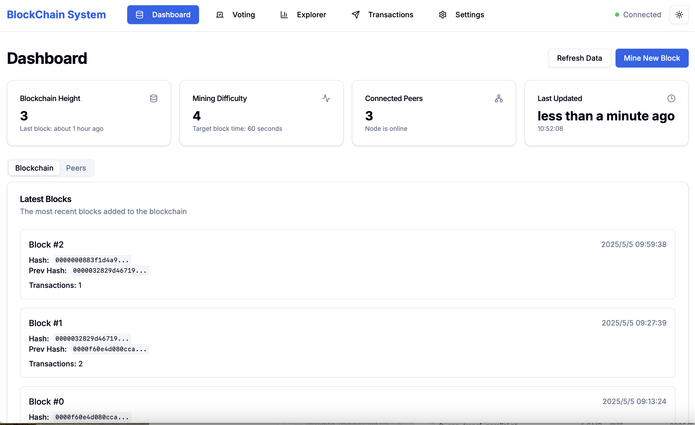
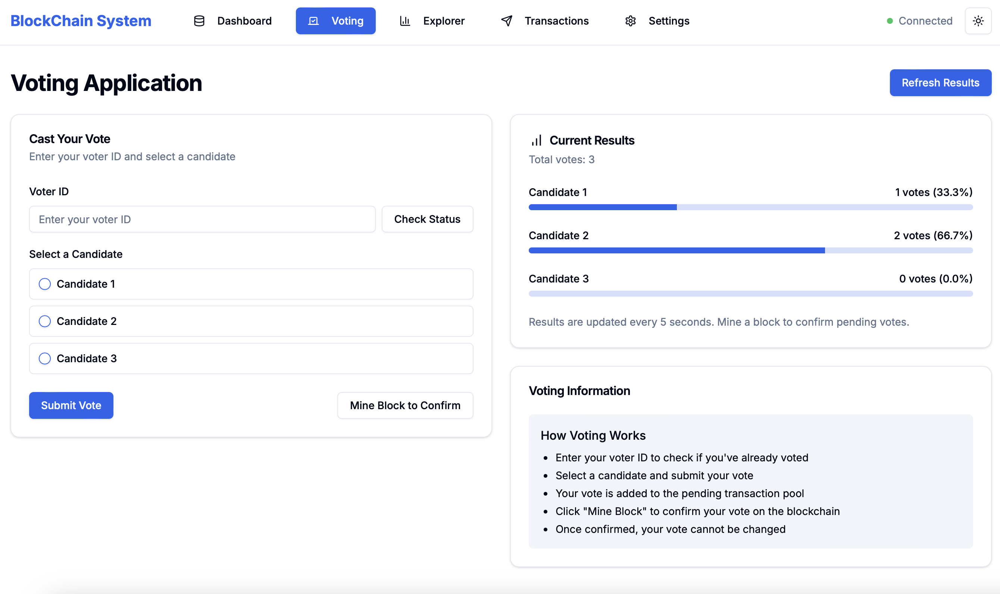
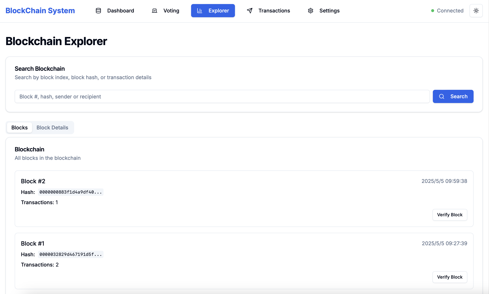
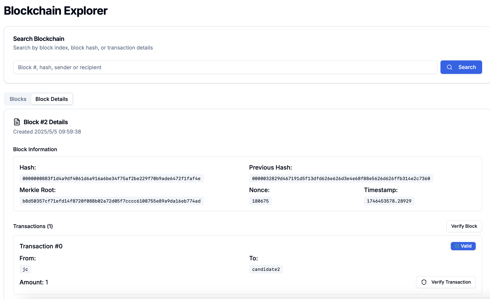
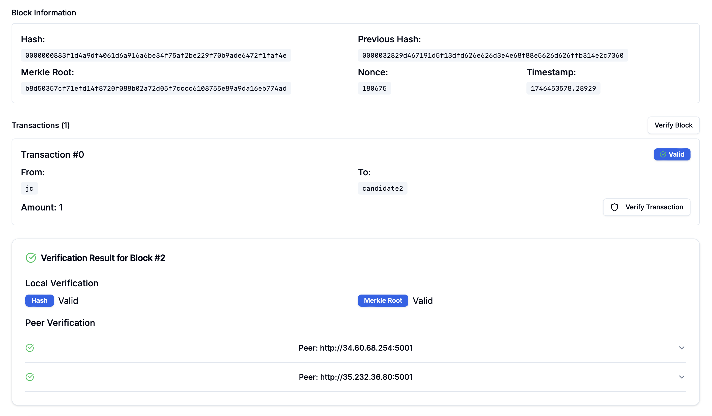
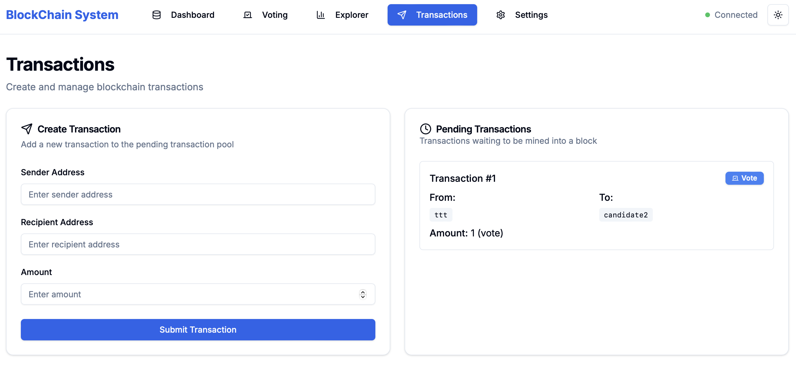
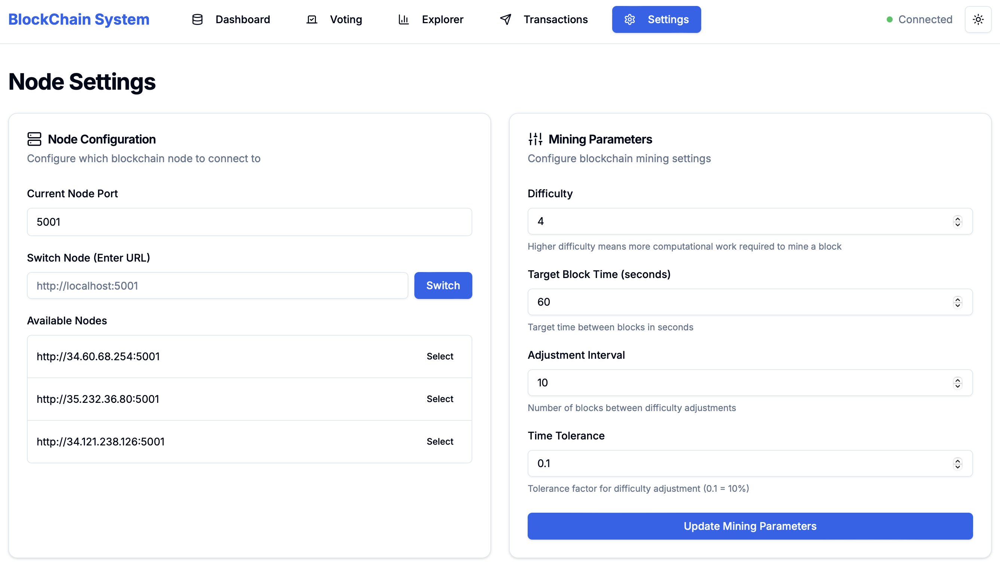

# Blockchain Voting System

A decentralized voting system built on blockchain technology, featuring a peer-to-peer network, proof-of-work consensus, and secure vote verification.

## Features

- Decentralized peer-to-peer network
- Proof-of-work consensus mechanism
- Automatic difficulty adjustment
- Secure vote verification using Merkle trees
- Real-time vote counting and statistics
- Fork resolution and chain synchronization
- Tamper detection and prevention

## Architecture

The system consists of three main components:

1. **Tracker Server**: Manages peer discovery and network coordination
2. **Client Nodes**: Run the blockchain and handle voting operations
3. **Frontend**: Web interface for voting and blockchain exploration

## Deployment

### Tracker Server (GCP)
```bash
python -m src.network.tracker --port 5001
```

### Client Nodes (GCP)
```bash
python -m src.network.client --tracker-url http://<tracker-ip>:5001 --port 5001 --host <client-ip>
```

### Frontend (Local)
1. Navigate to the frontend directory
2. Install dependencies: `npm install`
3. Start the development server: `npm start`
4. Update `context/BlockchainContext.tsx` with your GCP IPs:
   ```typescript
   const [nodeUrl, setNodeUrl] = useState("http://<client-ip>:5001");
   const baseURL = nodeUrl;
   const trackerURL = "http://<tracker-ip>:5001";
   ```

## API Endpoints

### Tracker Server
- `POST /register`: Register a new peer
- `POST /unregister`: Unregister a peer
- `POST /heartbeat`: Update peer's last seen timestamp
- `GET /peers`: Get list of active peers

### Client Nodes
- `POST /new_block`: Receive and validate new block
- `POST /transaction`: Add new transaction
- `POST /mine`: Mine pending transactions
- `GET /chain`: Get current blockchain
- `GET/POST /mining_params`: Get or update mining parameters
- `GET /peers`: Get list of peers
- `POST /edit_block`: Edit block content (testing)
- `GET /verify_block`: Verify block integrity
- `GET /verify_transaction`: Verify transaction integrity
- `GET /verify_transaction_internal`: Internal transaction verification
- `POST /edit_transaction_only`: Edit transaction (testing)

### Voting Endpoints
- `POST /vote`: Submit a new vote
- `GET /votes`: Get voting results
- `GET /vote_status`: Get voting status for a user
- `GET /candidates`: Get list of candidates
- `GET /voter_stats`: Get voting statistics

## Testing

See [TESTING.md](docs/TESTING.md) for detailed testing procedures and results.

## Requirements

- Python 3.8+
- Node.js 18+
- Dependencies listed in requirements.txt
- GCP VM instances for tracker and clients
- Local machine for frontend development

## Security Features

- Merkle tree verification
- Proof-of-work consensus
- Automatic difficulty adjustment
- Fork resolution
- Tamper detection
- Vote verification
- Double-voting prevention

## ✅ Completed Requirements

- Peer-to-peer network with **1 tracker** and **3+ client nodes**, all running on **Google Cloud VMs**
- Tracker maintains and synchronizes a live peer list
- Each peer node:
  - Maintains an up-to-date local blockchain
  - Mines new blocks and broadcasts them
  - Verifies and accepts blocks from others
  - Resolves forks when multiple valid branches exist
- Demo application: **Blockchain-based Voting System**
- Protection against tampering using **hash verification** and **Merkle tree proofs**

### 🔒 Bonus Features Implemented

- Interactive **frontend UI** for voting, exploration, and management
- **Dynamic mining difficulty** based on block times
- **Merkle Tree** verification for individual transactions
- Support for **multiple transactions per block**

## 🏗️ Project Structure

```bash
blockchain-voting/
├── blockchain-backend/                  # Backend system (tracker, peers, blockchain logic)
│   ├── src/
│   │   ├── blockchain/
│   │   │   ├── block.py
│   │   │   └── chain.py
│   │   ├── network/
│   │   │   ├── client.py
│   │   │   ├── tracker.py
│   │   │   └── voting.py
│   │   └── utils/
│   │       └── logger.py
│   ├── requirements.txt
│   └── README.md
├── blockchain-frontend/           # Frontend web UI
├── DESIGN.md                      # System architecture and diagrams
├── TESTING.md                     # GCP deployment setup and testing process
└── README.md                      # This file
```

## 🌐 Frontend UI Setup and Usage

The frontend interface is located in the `blockchain-frontend/` folder. It provides a user-friendly web interface to interact with the blockchain system and supports all major functionalities including voting, exploring blocks, managing transactions, and node configuration.

### Prerequisites

* Node.js 18+
* npm (comes with Node.js)

### Configuration

Before running the frontend, update the node configuration in `context/BlockchainContext.tsx`:

```typescript
const [nodeUrl, setNodeUrl] = useState("http://<client-ip>:5001");
const baseURL = nodeUrl;
const trackerURL = "http://<tracker-ip>:5001";
```

Replace `<client-ip>` with your GCP client VM's external IP and `<tracker-ip>` with your tracker VM's external IP.

### Running the Frontend

1. Navigate to the frontend directory:
```bash
cd blockchain-frontend
```

2. Install dependencies:
```bash
nvm use 18
npm install
```

3. Start the development server:
```bash
npm run dev
```

The frontend will be available at `http://localhost:3000/`.

### UI Overview

* **Dashboard**
  
  * Displays system parameters and blockchain status
  * Shows real-time blockchain height, mining difficulty, and node status

* **Voting**
  
  * Enter voter name and select candidate to cast vote
  * Vote records are stored in pending transactions
  * Click mine button to connect block to chain when pending transactions reach threshold
  * Automatically updates and tallies voting results

* **Blockchain Explorer - Overview**
  
  * Shows overall blockchain status
  * Displays basic information of all blocks
  * Click any block to view detailed information

* **Blockchain Explorer - Block Details**
  
  * Shows detailed content of selected block
  * Provides verify block and verify transaction functionality
  * Validates individual transaction records and entire block integrity
  * Detects any block tampering

* **Blockchain Explorer - Verification**
  
  * Provides block and transaction verification features
  * Supports Merkle tree verification
  * Ensures data integrity and immutability

* **Transaction Management**
  
  * Manually add new transaction records
  * Displays all pending transactions
  * Manages transaction pool

* **System Settings**
  
  * Switch between different backend nodes
  * Adjust mining difficulty and other parameters
  * Configure system runtime parameters